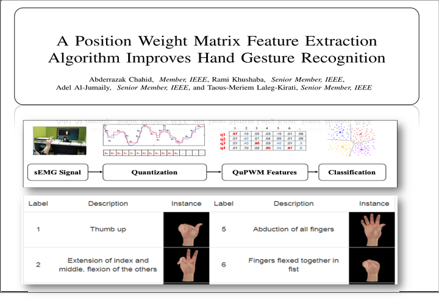

# Hand Gesture Recognition
A Quantization-based position Weight Matrix (QuPWM) feature extraction method for mult-iclass classification is proposed to improve the interpretation of biomedical signals. This method is validated on surface Electromyogram (sEMG) signals recognition for eight different hand gestures.

## Running
2- Use the main file: main.m

# Acknowledgement
The work is the result of research supported by King Abdullah University of Science and Technology [(KAUST)](https://www.kaust.edu.sa/en/) in collaboration with University of Technology, Sydney [(UTS)](https://www.uts.edu.au/). The authors would like to thank the students who participated in different phases of the project development and testing. For more details about the research team, please take a look at the published [paper](https://ieeexplore.ieee.org/abstract/document/9176097).
